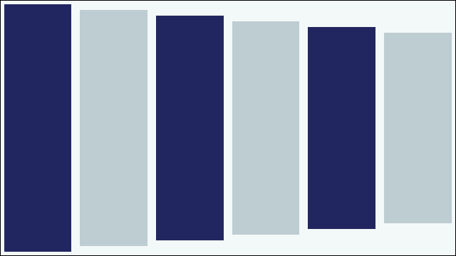
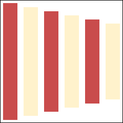
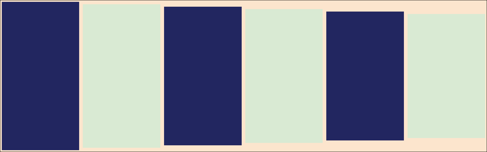

# Pictures and Links Report

## A picture on its own line

The paragraph that introduces the diagram. What follows is an image alone on its
line, which the renderer treats as a figure: centred, captioned with its alt
text, and never given a heading number.

## A picture Drive exported as a heading

Drive writes a picture that sits on its own line as a bold heading. The image is
therefore inside a Strong node, and a renderer that looks only at the top level
of the inline list finds nothing and drops it in silence.

# **![][image1]**

That heading holds nothing but a picture, so it must produce a figure and no
contents entry.

## A picture inside a paragraph

A pulled Google Doc puts its diagrams at the end of the paragraph that introduces
them, so a paragraph often holds a sentence and two drawings.  

The words come first, then each picture on its own line.

## A picture too wide for the column

The banner below is 1600 pixels across, which is wider than the text column, so
it must be scaled down to the column width and keep its aspect ratio.

## Links in running text

The [handbook](https://example.com/handbook) and the
[risk register](https://example.com/register?ref=policy&v=2) are both linked from
this sentence. A bare URL, <https://example.com/bare>, is a link too. A link
whose text carries **bold** and *italic* marks, like
[**this bold link**](https://example.com/bold), has to keep both.

## A table of links

| System | Owner | Runbook |
|--------|-------|---------|
| Ledger | Platform | [ledger runbook](https://example.com/rb/ledger) |
| Gateway | Payments | [gateway runbook](https://example.com/rb/gateway) |

[image1]: data:image/png;base64,iVBORw0KGgoAAAANSUhEUgAAAPAAAADwCAIAAACxN37FAAAEpUlEQVR4nOzawY3CMBCGUXvl61aDRBepNl0gUQ0FmNOcAImDSZzJ84nVXp9Gvz7lr3heotdKKb33+NPzDvxqrS60C53qQgMNNNBAAw000EBvALq9gr4tS/wc9q7rGj9daBfahXahXejvLjTQQAMNNNBAAw000EADDTTQQAMNdA7Q7eN/tn+Pe/wa9/4v8cuFdqFdaBf6aBdah9ahdWgdWofWoXVoHVqH1qF1aB1ah9ahdWgdWoce3aF3er7/zvT9t8lhcpgcJofJMevk0KF1aB1ah9ahdWgdWofWoXVoHVqH1qF16DN3aN9/Z/r+2+QwOUwOk8PkmHVy6NA6tA6tQ+vQOrQOrUPr0Dq0Dq1D69A6tA69Q4f2/fcPvv82OUwOk8PkMDlmnRw6tA6tQ+vQOrQOrUPr0Dq0Dq1D69A6tA6tQ5+nQ+f+/tvkMDlMDpPD5Jh1cgANNNBAAw000EADDTTQQAMNNNBAAw000EADDTTQQAMNNNBAAw000EADDTTQQAMNNNBAAw000EADDTTQQAMNNNBAAw000EADDTTQQAMNNNBAAw000EADDTTQQAMNNNBAAw000EADDTTQQAMNNNBAAw000EADDTTQQAMNNNBAAw000EADDTTQQAMNNNBAAw000EAD/Q70k506GAAAAEAg5m/dI4ybxAhNaEITmtCEJjShCU1oQhOa0IQmNKEJTWhCE5rQhCY0oQlNaEITmtCEJjShCU1oQhOa0IQmNKEJTWhCE5rQhCY0oQlNaEITmtCEJjShCU1oQhOa0IQmNKEJTWhCE5rQhCY0oQlNaEITmtCEJjShCU1oQhOa0IQmNKEJTWhCE5rQhCY0oQlNaEITmtCEJjShCU1oQhOa0IQmNKEJTWhCE5rQhCY0oQlNaEITmtCEJjShCU1oQhOa0IQmNKEJTWhCE5rQhCY0oQlNaEITmtCEJjShCU1oQhOa0IQmNKEJTWhCE5rQhCY0oQlNaEITmtCEJjShCU1oQhOa0IQmNKEJTWhCE5rQhCY0oQlNaEITmtCEJjShCU1oQhOa0IQmNKEJTWhCE5rQhCY0oQlNaEITmtCEJjShCU1oQhOa0IQmNKEJTWhCE5rQhCY0oQlNaEITmtCEJjShCU1oQhOa0HGhL/TYtWMUB2IYDKMWpJ3TDOTiPqBTqU4gcbDEU5Wttvn4MY8RtKAFLWhBC1rQgha0oAUtaEELWtCCFrSgBS1oQQta0IIWtKAFLWhBC1rQgha0oN8F/cgfzm2+685fFtpCW+jPFppDc2gOzaE5NIfm0ByaQ3NoDs2hOTSH5tAcmkNz6JIO/Zwzf1poC22hz15oDs2hOTSH5tAcmkNzaA7NoTk0h+bQHJpDc2gOzaG/c+jr/vd/tNAW2kLXWmgOzaE5NIfm0ByaQ3NoDs2hOTSH5tAcmkNzaA7dxKF7fx9soS20hS680ByaQ3NoDs2hOTSH5tAcmkNzaA7NoTk0h+bQHPrXDu374A3fB1toC22hCy+0oAUtaEELWtCCFrSgBS1oQQta0IIWdI+gY4yx1so/nSt8EeHJ4cnhyeHJ4clx6pND0IIWtKAFfWrQzrW61wBZ9xruazn3BwAAAABJRU5ErkJggg==
