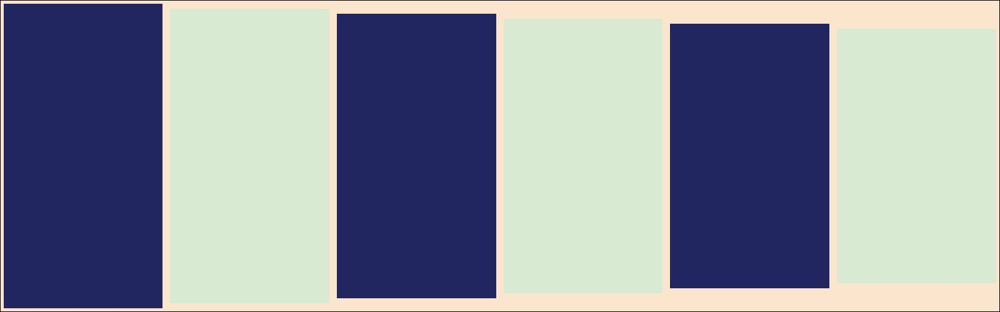

# Edge Cases & Awkward Input

## Risk & Control <ampersands>

An ampersand in a heading has to survive being written into XML, read back out
of it for the contents list, and matched against the page it landed on. Escaping
it twice puts "&amp;" on the contents page. The body text carries them too: AT&T,
R&D, "fish & chips", and a literal < and > for good measure.

## Résumé of Änderungen: naïve café

Accented characters exercise the slug, the contents entry, and the outline match
that resolves the page number. The Turkish dotless ı, the German ß, the Polish ł
and the Icelandic þ all appear here: ıßłþ.

## Overview

The first section called Overview. There is a second one further down carrying
exactly the same heading text, which is what makes the page-number lookup
interesting: matched by text alone, both would resolve to whichever comes first.

### A table with an empty cell and a very long token

| Field | Value | Note |
|-------|-------|------|
| Reference | ABCDEFGHIJKLMNOPQRSTUVWXYZ0123456789 | A token no column can fit |
| Empty |  | The middle cell is blank |
| Short | x | y |

### A task list

- [ ] An unchecked item.
- [x] A checked item.
- [ ] A third item, long enough to wrap so the hanging indent is exercised the
      same way an ordinary bullet is.

### Strikethrough and nesting

Text with ~~a struck-out span~~ inside it, and **bold containing *italic*
containing `code`** to check that the marks nest the way they should.

> A quote containing a list:
>
> - first
> - second
>
> and a closing line.

## A JPEG

The picture below is a JPEG rather than a PNG, so the size has to come from the
frame header rather than from a PNG chunk.

## Overview

The second section called Overview, which must resolve to its own page rather
than to the first one's.

## A heading with a [link](https://example.com/in-a-heading) in it

A link inside a heading has to keep its text on the contents page, and the
contents entry must still match the outline entry Google writes for it.

## 4.2 A self-numbered heading at an odd depth

The author's number has two parts but the heading sits at the top level, so it
does not fit the depth it is at. It is left unnumbered rather than doubled, and
it moves nothing.

## The last section

Which must be numbered as though the odd one above had not happened.
